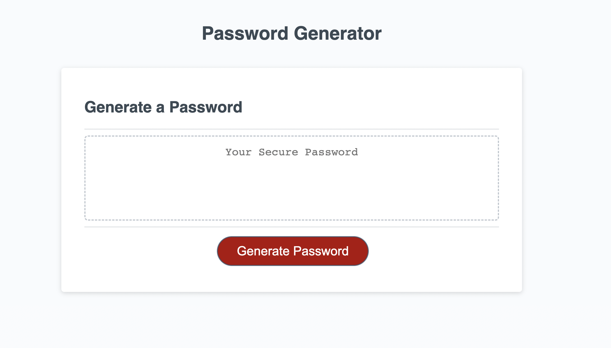

# Secure KeyGen Password Generator

## Overview
This application allows users to generate a random password based on certain criteria that they can select. With a clean, responsive UI, users can decide the password length (between 8 and 128 characters) and whether to include lowercase, uppercase, numberic, and special characters in the password. This app increases security by providing users with a unique, hard-to-guess password each time.

## Features
- Length Selection: Users can specify the length of their desired password, with a minimum of 8 characters and a maximum of 128 characters.
- Character Type Selection: Users can include lowercase, uppercase, numberic and special characters in their passwords. These options are presented as promps when initiating the password-generation process.
- Random Password Generation: Upon confirming their preferences, the user receives a unique, randomly generated password that meets their criteria.
- Input Validation: The app validates user inputs to ensure at least one chracter type is selected and the length is within the defined limits.

## Screenshots

## Technologies Used
- HTML
- CSS
- JavaScript

## Live Demo
This project's live version can be found [here](https://lightoftwelve.github.io/secure-keygen-password-generator).

## Credits
This project was accepted and completed as part of the UofT SCS Coding Boot Camp Online: Fullstack Flex PT course through the University of Toronto. The original project (HTML, CSS and partially started JavaScript file) was created by edX Boot Camps LLC. and has been modified for the purpose of this assignment.

This project's JavaScript file was written by myself, Victoria Alawi, except where indicated at the bottom of the JavaScript file, marked starting at // Assignment Code.
- Github: [@lightoftwelve](https://github.com/lightoftwelve)
- LinkedIn [@Victoria Alawi](https://www.linkedin.com/in/victoria-alawi-872984250/)
- Website: [www.lightoftwelve.com](http://www.lightoftwelve.com)

## License
N/A
